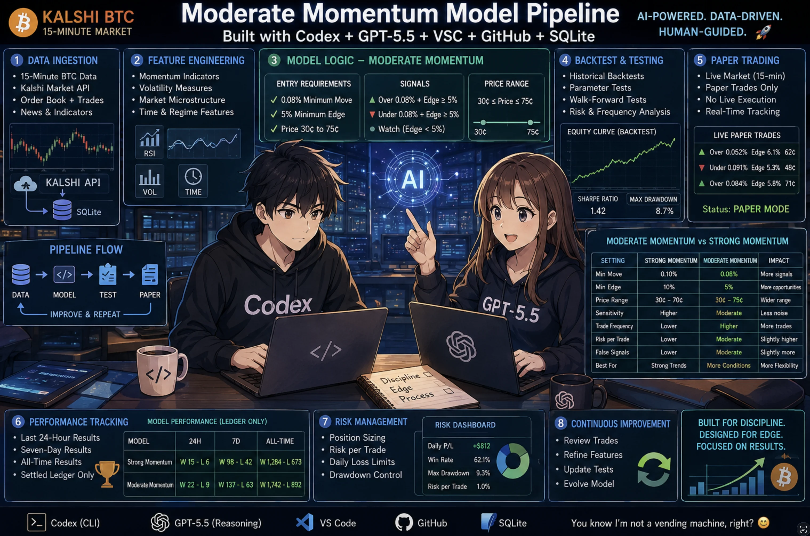

# BTC 15-Minute Strong Momentum

A deliberately small command-line bot for one Kalshi prediction-market strategy:
**BTC 15-minute Strong Momentum**. It can paper trade or, after an explicit
safety procedure, place live trades. Paper mode is always the default.

> Research software, not financial advice. Paper fills are simulations. The
> original experiment had only ten settled Strong Momentum trades, so its early
> 90% result is not enough to establish a durable edge.
>


## What the model does

Once per minute the bot reads public Coinbase one-minute candles and active
Kalshi `KXBTC15M` markets. It considers a contract only when:

- 2–12 minutes remain;
- its ask is 20–85 cents with a spread no wider than 5 cents;
- Bitcoin has moved at least 0.12% from the window reference;
- the window move and recent three-minute move agree with the trade direction;
- the latest candle is no older than 120 seconds;
- estimated edge is at least 3%, or 12% when Coinbase must proxy the settlement reference;
- the last ten signals are not already 80% or more on that side.

It chooses the qualifying side with the greatest estimated profit, takes at
most one contract, and holds it through settlement. Paper and live modes use
the same signal function and separate ledger tables.

## Ten-minute setup

### Minute 0–2: prepare the computer

Ubuntu/Debian:

```bash
sudo apt update
sudo apt install -y git python3 python3-venv
```

### Minute 2–3: clone

```bash
git clone https://github.com/preceptress/btc-15-minute-prediction-model.git
cd btc-15-minute-prediction-model
```

### Minute 3–6: install safely

```bash
chmod +x setup.sh scripts/install_timer.sh
./setup.sh
```

This creates `venv/`, installs three Python packages, creates a blank local
`.env`, runs tests, initializes a fresh SQLite ledger, and confirms paper mode.
It does not submit an order or install the timer automatically.

### Minute 6–7: run the first paper scan

```bash
./venv/bin/python scripts/btc_bot.py cycle
```

Zero trades is a valid result when no market passes every filter.

### Minute 7–8: see status and results

```bash
./venv/bin/python scripts/btc_bot.py status
./venv/bin/python scripts/report.py
./venv/bin/python scripts/report.py --json
```

### Minute 8–10: automate the scan (Linux with systemd)

```bash
./scripts/install_timer.sh
systemctl --user status btc-15m.timer
journalctl --user -u btc-15m.service -n 30
```

The timer runs one cycle per minute. Stop it with:

```bash
systemctl --user disable --now btc-15m.timer
```

## Paper or live

There are exactly two modes:

- **Paper:** default, no credentials, simulated fills, `$1,000` fresh bankroll.
- **Live:** real orders and real loss risk; requires Kalshi credentials and the
  separate checklist in [LIVE_TRADING.md](LIVE_TRADING.md).

Adding keys to `.env` does not enable live mode. The database gate also requires
the exact activation phrase.

## Work on it with Codex

The official OpenAI Codex CLI installer for macOS/Linux is:

```bash
curl -fsSL https://chatgpt.com/codex/install.sh | sh
```

Then open this local repository and start Codex:

```bash
cd btc-15-minute-prediction-model
codex
```

On first launch, choose **Sign in with ChatGPT** or another available sign-in
method. Codex operates on files in the directory where you launch it. See the
[official Codex CLI guide](https://learn.chatgpt.com/docs/codex/cli).

Try plain-English requests such as:

```text
Explain the Strong Momentum model without changing files.
```

```text
Run the tests and tell me whether paper mode is active.
```

```text
Show the last 24-hour and 7-day paper results. Do not estimate missing trades.
```

```text
Inspect recent scan rejection reasons. Do not alter the filters.
```

```text
Review my proposed change, add tests, but do not enable live mode.
```

Never paste `.env`, a private key, API credentials, or private ledger data into
a conversation.

### First things to ask Codex

After installing Codex and opening this repository, start with these requests:

```text
Inspect this project and explain what it does in plain English. Do not change
any files.
```

```text
Show me how to run this project locally. Check whether anything is missing, but
do not install or change anything yet.
```

```text
Map the pipeline from the trading signal through paper execution, settlement,
reporting, tests, and the one-minute timer. Identify every safety gate.
```

```text
Run the existing checks and give me a readiness report. Confirm whether paper
mode is active and whether live trading is disabled.
```

```text
Read README.md, AGENTS.md, and LIVE_TRADING.md. Tell me what could confuse a new
user and recommend the three highest-impact documentation improvements. Do not
make changes yet.
```

```text
Recommend the next three improvements to this project, ranked by impact and
risk. Keep every proposal paper-only and do not make changes yet.
```

For a complete first review, use:

```text
You are onboarding me to this project. Inspect the repository and explain what
the application does, how it is organized, how to run it locally, and how a
signal moves through paper trading, settlement, and reporting.

Identify the tests, timer, required environment variables, external services,
project instructions, and every safeguard separating paper and live trading.
Do not install software, expose secrets, enable live trading, submit orders, or
make changes yet.

Finish with:
1. Anything missing or broken
2. The three biggest onboarding risks
3. The three best next steps
4. Questions that must be answered before changing the project
```

## Planned: conversational model laboratory

The repository currently runs one fixed strategy: **Strong Momentum**. A planned
extension will let researchers use plain-English conversations with Codex to
create named variations, review their settings, and explicitly activate the
ones they want the one-minute timer to evaluate.

This is a roadmap, not a description of functionality that already exists.
Until it is implemented and tested, editing values in an example below will not
create or activate another model.

### What a model configuration could contain

Each model would be a small, reviewable configuration rather than a copied
trading program. For example:

```json
{
  "name": "Strong Momentum",
  "active": true,
  "mode": "paper",
  "starting_bankroll": 1000.00,
  "min_price": 0.20,
  "max_price": 0.85,
  "max_spread": 0.05,
  "min_minutes_left": 2,
  "max_minutes_left": 12,
  "min_move": 0.0012,
  "min_edge": 0.03,
  "proxy_min_edge": 0.12,
  "confirmation_minutes": 3,
  "max_candle_age_seconds": 120
}
```

The saved configuration—not Codex—would make the trading decision. Codex would
help propose, explain, validate, and edit configurations. The deterministic bot
would load the reviewed configurations during each timer cycle.

### Example conversations

Create an idea without putting it into play:

```text
Create a new paper model called Moderate Momentum.

Base it on Strong Momentum, but require a 0.08% move, use a 5% minimum
edge, and accept prices between 30 and 75 cents. Keep it inactive until I
review it. Show every value that changed and add tests.
```

Compare it with its parent:

```text
Show exactly how Moderate Momentum differs from Strong Momentum. Explain how
each changed value could affect trade frequency and risk. Do not activate it.
```

Activate it for simulations only:

```text
Activate Moderate Momentum for paper trading only. Confirm that live trading
is still disabled, then run the tests and show the active-model list.
```

Review the results later:

```text
Show each model's last 24-hour, seven-day, and all-time paper results. Use only
settled ledger trades and do not estimate missing results.
```

### Proposed model commands

The command-line interface could expose the same actions directly:

```bash
./venv/bin/python scripts/models.py list
./venv/bin/python scripts/models.py show strong-momentum
./venv/bin/python scripts/models.py clone strong-momentum moderate-momentum
./venv/bin/python scripts/models.py diff strong-momentum moderate-momentum
./venv/bin/python scripts/models.py activate moderate-momentum --paper
./venv/bin/python scripts/models.py deactivate moderate-momentum
```

New models would be created **inactive** and **paper-only**. A paper activation
would never activate live trading. Live activation would use a different
command, additional validation, credentials, and an exact confirmation phrase.

### How the one-minute timer would work

Each timer cycle would:

1. Download Coinbase candles and Kalshi markets once.
2. Load every active model configuration.
3. Evaluate each active model independently against the same data snapshot.
4. Record qualifying paper trades in that model's separate ledger.
5. Maintain a separate starting bankroll, cash balance, open positions, and
   performance record for every model.
6. Skip inactive models completely.

```text
One-minute timer
       |
       v
Shared Coinbase + Kalshi snapshot
       |
       +----> Active Model A ----> Model A ledger and bankroll
       +----> Active Model B ----> Model B ledger and bankroll
       +----> Active Model C ----> Model C ledger and bankroll

Inactive models are not evaluated.
```

Running several models would not mean submitting several live orders. Paper
models could independently simulate the same market. Live execution would need
an additional portfolio-level coordinator to prevent duplicate or conflicting
orders across models.

### Versioning and auditability

Changing a model after it has traded must not rewrite history. Every saved
revision should receive an immutable version identifier. Each ledger row should
record:

- model name and version;
- the complete effective settings or their cryptographic hash;
- signal probability, edge, price, spread, and market-data timestamp;
- entry and settlement timestamps;
- whether the fill was simulated or an actual exchange fill.

Reports could then compare model versions without mixing trades produced by
different settings.

### Example multi-model report

```text
ACTIVE PAPER MODELS

Model                 Trades     W-L    Win%      P/L    Open
Strong Momentum           10     9-1    90.0%    $2.64       0
Moderate Momentum          32    22-10   68.8%    $4.81       1
Wide Momentum              47    29-18   61.7%    $2.22       0
```

Those numbers are formatting examples only; they are not claims about actual
trades. Real reports must always come from the local SQLite ledger.

### Required safety rules

- Every new model defaults to inactive and paper-only.
- Each paper model starts with its own explicit bankroll.
- Configuration validation rejects impossible ranges and unsafe values.
- Activation and configuration changes are recorded in an audit log.
- Paper and live ledgers remain visibly distinct.
- Live models require the complete [live checklist](LIVE_TRADING.md), explicit
  activation, and portfolio-level exposure controls.
- Credentials and private keys never appear in model configuration files.
- The one-minute timer never invents results; only exchange settlements close
  trades and determine wins, losses, and P/L.

## Repository map

```text
scripts/btc_bot.py       model, paper ledger, and gated live execution
scripts/report.py        read-only 24h, 7d, and all-time report
scripts/install_timer.sh optional user-level systemd installation
tests/                    focused offline tests
LIVE_TRADING.md           mandatory live-mode procedure
AGENTS.md                 safety instructions for Codex
```

## Questions and feedback

Questions, ideas, and bug reports are welcome. Please
[open a GitHub issue](https://github.com/preceptress/btc-15-minute-prediction-model/issues/new).

Do not include API keys, private keys, `.env` contents, account details, or
private trading records.


